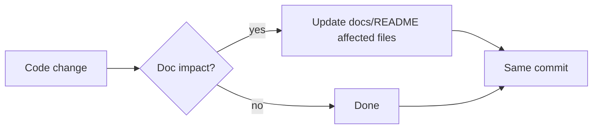

# AGENTS.md

Guidance for AI agents (and humans) working on Datara.

## Project context

Datara is a native Linux **MSSQL** database client: Rust + Slint, Wayland,
single binary `datara`, GPL-3.0, app ID `io.github.ntxinh.Datara`. Cargo
workspace of `datara-*` crates under `crates/`; declarative UI in `ui/`.
Rust `1.98.1` is pinned by `mise.toml`.

Current state: **MVP complete**. All crates and features are implemented.
Write docs and code for what exists — mark planned work as planned.

## Architecture rules (non-negotiable)

- No business logic in `.slint` files — view state and callbacks only.
- No database calls from the UI layer — UI talks to `DatabaseService` via the
  app bridge.
- MCP reuses the application services — never a second database layer.
- Passwords only in Secret Service — never in SQLite, TOML, logs, error
  messages, `Debug`/`Display`/`Serialize` impls.
- No PostgreSQL or SQLite *driver* implementations yet (SQLite is used for
  local state only).
- No SSH tunnels, no AI features, no telemetry, no accounts.
- No silent TLS downgrade; `trust_server_certificate` is a user choice.
- Table preview is `SELECT TOP N` (default 1000) — never unbounded `SELECT *`.
- UI thread never blocks; all DB I/O on Tokio.
- XDG paths via `dirs`; `Config::default_port() = 1433` is the only port
  constant.

## Dev commands

```sh
mise install          # install the pinned toolchain
make setup            # toolchain + cargo-audit/deny + fontconfig
make build            # cargo build --workspace
make run              # cargo run -p datara (GUI)
make test             # cargo test --workspace
make test-integration # container-backed MSSQL tests (needs podman socket)
make lint             # cargo clippy --workspace --all-targets -- -D warnings
make fmt / fmt-check  # rustfmt
make check            # cargo check --workspace
make audit            # cargo audit
make deny             # cargo deny check
make docs-check       # verify docs/README.md index integrity
make rpm / flatpak    # packaging builds (see Makefile comments for deps)
```

## Coding conventions

- Simple readable Rust; no speculative abstractions or dependencies.
- `thiserror` `DomainError` variants inside the workspace; `anyhow` only at
  binary boundaries (`main.rs`).
- Async (`tokio`) only for real I/O — not for CPU work or ceremony.
- Workspace dependencies only: versions live in root `Cargo.toml`; member
  manifests use `{ workspace = true }`. Never put version numbers in member
  manifests.
- `// ponytail:` comment on any deliberate simplification with a known
  ceiling, naming the upgrade path.
- UI text in English; no emoji in UI or docs.

## Testing

- Unit tests beside code in `#[cfg(test)] mod tests`; integration tests in
  `crates/<x>/tests/` and top-level `tests/`.
- MSSQL integration tests use the shared testcontainers harness over Podman;
  they skip (early return + eprintln) when no container socket exists, except
  under `make test-integration`.
- `rstest` for parameterized cases. Keep tests deterministic.

## Doc-sync workflow



**Rule:** a behavior change and its doc update land in the *same commit*.
Never defer doc updates to a follow-up. If a task adds/removes a documented
file, update `docs/README.md` in that commit (`make docs-check` enforces the
index).

## Git rules

- Small, focused commits — one task/concern per commit.
- Conventional messages: `feat(<crate>):`, `fix:`, `docs:`, `chore:`,
  `test:`, `refactor:`.
- Repo must stay buildable: every commit ends with fmt + clippy + tests +
  build green.
