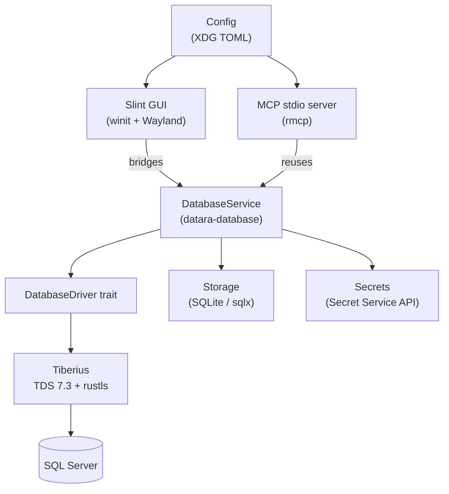
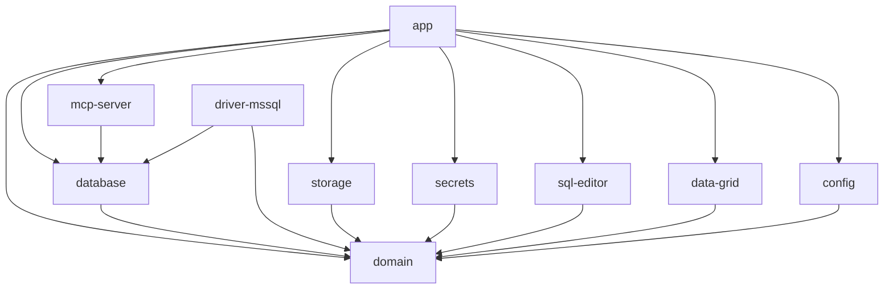

# Datara — Design

Architecture of Datara as shipped for the MVP. All phases are implemented;
the **Deviations** section at the end lists where the shipped code differs
from `docs/superpowers/specs/2026-09-27-datara-design.md`.

## 1. System architecture

One binary, `datara`, with two entry modes: the Slint GUI (default) and a
stdio MCP server (`datara mcp-serve`). Both modes share the same database
service layer — the MCP server never duplicates driver logic.



Dependency direction is strictly downward:

```
UI (Slint) → app → domain → infrastructure → drivers
```

- `datara-domain` never depends on Slint, sqlx, or Tiberius.
- `datara-app` is the only crate that depends on Slint.
- `datara-mcp-server` depends on `datara-database`, never on drivers directly.

## 2. Application architecture (workspace)

Ten crates under `crates/`, named `datara-<layer>`:

| Crate | Role | State |
|---|---|---|
| `app` | CLI (clap), Slint bridge, service wiring, `mcp-serve` entry | *(implemented)* |
| `domain` | `ConnectionProfile`, `QueryResult`, `Value`, `DomainError`, `Command` | *(implemented)* |
| `database` | `DatabaseDriver`/`DatabaseSession` traits, `DatabaseService` | *(implemented)* |
| `driver-mssql` | Tiberius implementation of the traits | *(implemented)* |
| `sql-editor` | Statement detection (sqlparser), highlighting, completion | *(implemented)* |
| `data-grid` | `RowCache`, virtualized row model | *(implemented)* |
| `secrets` | Secret Service store | *(implemented)* |
| `mcp-server` | rmcp stdio server + tools | *(implemented)* |
| `storage` | SQLite repos: connections, history, saved queries | *(implemented)* |
| `config` | XDG paths (`AppPaths`), TOML settings (`AppConfig`) | *(implemented)* |

All third-party versions live only in the root `Cargo.toml`
(`[workspace.dependencies]`); member manifests use `{ workspace = true }`.

### Crate dependency graph



`app` composes `driver-mssql` into `DatabaseService` at startup; nothing else
names the driver.

## 3. UI architecture

- Declarative `.slint` files under `ui/` (`app.slint`, `theme.slint`,
  `components/`, `pages/`, `dialogs/`, `editor/`, `grid/`); compiled by
  `slint-build` in `crates/app/build.rs` with the fluent style.
- Slint contains **view state only**. All actions cross a bridge in
  `crates/app/src/` (callbacks → commands → `DatabaseService` on Tokio).
- Keyboard-first: a `Command` enum (in `domain`) is the single source of
  shortcut bindings; components never hard-code keys.
- `ui/app.slint` hosts the full shell — sidebar schema tree, editor tabs,
  results grid, dialogs — *(implemented)*; `theme.slint` defines the
  dark/light palette *(implemented)*.

## 4. Database architecture

`DatabaseDriver::connect(profile, credentials) -> DatabaseSession`; sessions
expose `list_databases`, `list_schemas`, `list_tables`, `describe_table`,
`execute(database, query, max_rows)`, `cancel`, `quote_ident`. `list_*` takes
a database because MSSQL metadata requires a database context; `execute`
takes `max_rows` so drivers must cap materialization. Traits and the
`DatabaseService` — session-per-connection pool, cancellation, history
recording — are *(implemented)* in `datara-database`.

## 5. MSSQL driver

Tiberius 0.13 over TDS 7.3 with the rustls TLS backend. One Tokio TCP stream
per session; `cancel` aborts the in-flight execute task, dropping the stream
(attention-packet cancellation is a noted upgrade). `quote_ident` uses
`[brackets]` with `]` escaped as `]]`. Value conversion maps TDS types onto
`domain::Value` (Null/Bool/Int/Float/Decimal/Text/Bytes/DateTime/Uuid).
*(Implemented).*

## 6. SQL editor

`datara-sql-editor` provides pure functions: `detect_statement` (sqlparser-rs
with MSSQL dialect, byte-range output), tokenizer-based highlighting, and a
small completion provider. The Slint editor component calls `ExecuteQuery` on
Ctrl+Enter via the command system; execution never blocks the UI thread.
*(Implemented).*

## 7. Data grid

`datara-data-grid` holds a `RowCache` keyed by row index plus a
`VirtualizedRows` model exposing only the viewport window to Slint — no
per-cell components. Responsive at tens of thousands of rows. Copy
cell/row/selection via clipboard; NULL renders as `NULL`. *(Implemented).*

## 8. Secrets

Passwords live only in the Secret Service API (GNOME Keyring; visible in
Seahorse). `ConnectionProfile` stores a `SecretReference` like
`mssql/7/password`; the actual secret is fetched at connect time and wrapped
in `secrecy::SecretString` so it cannot appear in `Debug`/`Display`/`serde`
output or error messages. The `datara-secrets` store and the domain types
are *(implemented)*.

## 9. TLS

`EncryptionMode::{Disabled, Preferred, Required}` maps onto Tiberius config.
Never silently downgraded: certificate errors surface to the user;
`trust_server_certificate` is a per-profile, user-visible boolean, not a
fallback. *(Implemented)* — full matrix in `docs/security/tls.md`.

## 10. MCP server

`datara mcp-serve` runs an rmcp server over stdio only — no network
transport. Tools: `list_connections`, `list_databases`, `list_tables`,
`describe_table`, `search_schema`, `execute_query`. Every query tool takes an
explicit `conn_id`; results cap at `mcp.max_result_rows` (default 1000) and
report `truncated`. The server resolves credentials the same way the GUI
does and never returns secrets. *(Implemented).*

## 11. Local storage

SQLite via sqlx (bundled), at `~/.local/share/io.github.ntxinh.Datara/app.db`.
Tables: `connections` (metadata + `secret_reference`, no password column),
`query_history`, `saved_queries`. Migrations in
`crates/storage/migrations/`. *(Implemented)*.

## 12. Configuration

`~/.config/io.github.ntxinh.Datara/config.toml`, loaded with serde defaults —
missing file yields `AppConfig::default()`, malformed TOML errors naming the
path. Sections: `editor`, `query` (`default_limit = 1000`,
`timeout_seconds = 30`), `appearance`, `mcp` (`enabled = false`,
`max_result_rows = 1000`). `AppConfig::default_port() = 1433` is the single
source for the MSSQL port. XDG paths via `dirs`; no hard-coded `~`.
*(Implemented)*.

## 13. Errors

`DomainError` (thiserror) is the workspace error type: `Connection`,
`Authentication`, `Tls`, `Query{error_number,line,column}`, `Schema`,
`Storage`, `Secret`, `Config`, `Cancelled`, `Driver`. Variants carry
user-readable messages; SQL Server error numbers/positions are preserved for
the editor. `anyhow` is used only at binary boundaries (`main`). *(Domain
errors implemented.)*

## 14. Concurrency

One Tokio multi-thread runtime for the process. All database I/O runs on it;
the Slint UI thread never blocks — bridge calls spawn tasks and deliver
results back via `slint::invoke_from_event_loop`. Cancellation aborts the
execute `JoinHandle`, dropping the TCP stream (see Deviations). Async is
used only for real I/O. *(Implemented).*

## 15. Performance

- Grid renders only the viewport; rows stream into `RowCache` incrementally.
- `execute` caps at `max_rows` at the driver, not the UI.
- Benchmarks (statement splitting, highlighting, grid viewport, row
  conversion, startup proxy) via criterion — *(implemented)*, baselines in
  `docs/development/performance.md`.

## 16. Security

Secrets-only-in-Secret-Service (§8), no silent TLS downgrade (§9), bounded
previews and results (§4, §10), no credential material in logs or errors,
MCP stdio-only with explicit connection scoping (§10). `cargo-audit` and
`cargo-deny` gate CI (`deny.toml` allowlist).

## 17. Packaging

- **RPM:** `packaging/rpm/datara.spec`, cargo build in `%build`, standard
  Fedora paths; `rpmbuild -ba` verified in a fedora:44 container. *(Implemented).*
- **Flatpak:** `io.github.ntxinh.Datara.yml` + vendored `cargo-sources.json`;
  minimal permissions — Wayland, Secret Service (session bus), network.
  *(Implemented; CI exercises the sandbox build.)*
- Desktop entry + AppStream metainfo in `packaging/share/`. *(Implemented.)*

## 18. Deviations from the spec

Deliberate deltas between `docs/superpowers/specs/2026-09-27-datara-design.md`
and the shipped code:

- **Test layout:** the top-level `tests/` carries only a `README.md`; real
  integration tests live in `crates/driver-mssql/tests/` and
  `crates/mcp-server/tests/` because `cargo test --workspace` only
  discovers member-package targets.
- **`saved_queries` ships in `0001_init.sql`** — no second migration was
  needed for the history/saved-queries phase.
- **Editor highlight fallback:** the Task 4.2 overlay renders per-token
  spans; a single-color + gutter fallback exists if per-token `Text`
  alignment drifts.
- **`mcp.enabled` defaults to `false`** (safe default per spec §17);
  `datara mcp-serve` refuses cleanly until it is set.
- **Cancellation is abort-via-drop:** `cancel()` aborts the execute
  `JoinHandle`, dropping the TCP stream. TDS attention-message
  cancellation is a documented upgrade, noted in `service.rs`.
- **Ctrl+K maps to the schema-tree filter** (the spec's generic "Search");
  Ctrl+P opens the command palette.
